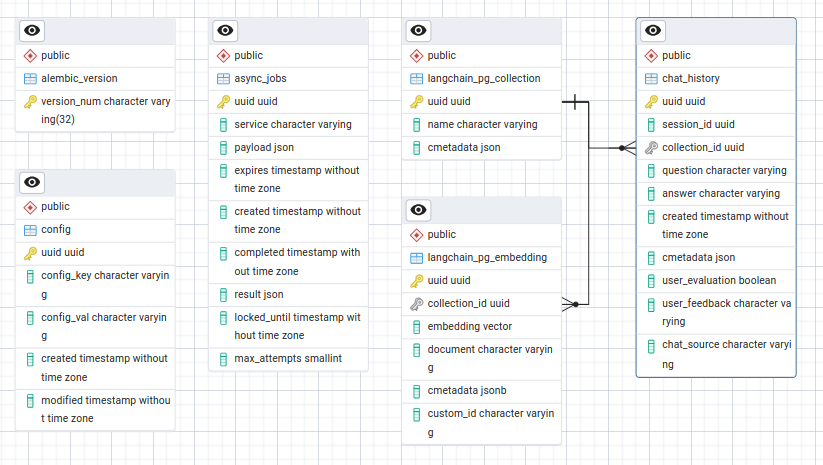

# Database

Brevia data are stored in a [Postgres](https://www.postgresql.org/) database, any version from v12 onwards is supported.
PostgreSQL provides [ACID](https://en.wikipedia.org/wiki/ACID) compliance, point-in-time recovery, JOINs, and [many other great features](https://www.postgresql.org/about/).

## Schema

Brevia database schema consists, as of now, of just five tables:

* `alembic_version` - used by [Alembic](https://alembic.sqlalchemy.org) to keep track of migration status
* `async_jobs` - store [asynchronous jobs](async_jobs.md) data
* `langchain_pg_collection` - collection information, table used by Postgres vector store in [LangChain](https://github.com/langchain-ai/langchain)Chain
* `langchain_pg_embedding` - collection embeddings, used by Postgres vector store in LangChain
* `chat_history` - store chat messages history


Here a simple ERD diagram of Brevia database schema



## Migrations

Schema migrations are handled by [Alembic](https://alembic.sqlalchemy.org). You can create or update the database schema to the latest version using this command, after activating the virtual env (with `poetry shell` for instance)

```bash
db_upgrade
```

This command should be launched after every upgrade of Brevia make sure the db structure is up to date.
